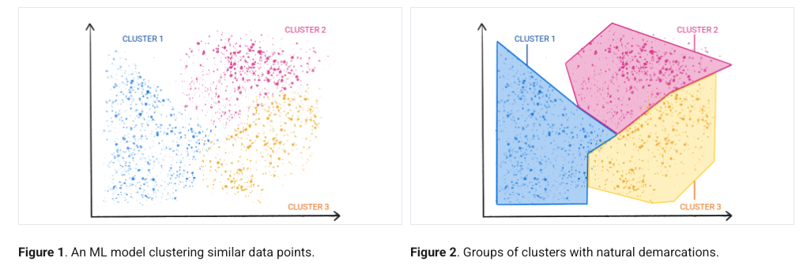

# Machine Learning

**ML** is the process of `training` a piece of software, called a `model`, to make useful `predictions` or generate content (like text, images, audio, or video) from data.

## Types of ML Systems
ML systems fall into one or more of the following categories based on how they learn to make predictions or generate content:

- Supervised learning
- Unsupervised learning
- Reinforcement learning
- Generative AI

### Supervised learning

Supervised learning models can make predictions after seeing lots of data with the correct answers and then discovering the connections between the elements in the data that produce the correct answers. These ML systems are "supervised" in the sense that a human gives the ML system data with the known correct results.

Supervised machine learning is based on the following core concepts:

- Data
- Model
- Training
- Evaluating
- Inference

Two of the most common use cases for supervised learning are regression and classification.

#### Regression

A regression model predicts a numeric value. For example, a weather model that predicts the amount of rain, in inches or millimeters, is a `regression model`.

See the table below for more examples of regression models:

- **Future house price**	
  - **Inputs:** Square footage, zip code, number of bedrooms and bathrooms, lot size, mortgage interest rate, property tax rate, construction costs, and number of homes for sale in the area.	
  - **Output:** The price of the home.

- **Future ride time**	
  - **Inputs:** Historical traffic conditions (gathered from smartphones, traffic sensors, ride-hailing and other navigation applications), distance from destination, and weather conditions.	
  - **Output:** The time in minutes and seconds to arrive at a destination.

#### Classification

Classification models predict the likelihood that something belongs to a category.

Classification models are divided into two groups: `binary classification` and `multiclass classification`. 

- `Binary classification models` output a value from a class that contains only two values, for example, a model that outputs either `rain` or `no rain`. 
- `Multiclass classification models` output a value from a class that contains more than two values, for example, a model that can output either `rain`, `hail`, `snow`, or `sleet`.

### Unsupervised learning

Unsupervised learning models make predictions by being given data that does not contain any correct answers. An unsupervised learning model's goal is to identify meaningful patterns among the data.

A commonly used unsupervised learning model employs a technique called `clustering`. The model finds data points that demarcate natural groupings.

### Reinforcement learning

Reinforcement learning models make predictions by getting rewards or penalties based on actions performed within an environment. A reinforcement learning system generates a policy that defines the best strategy for getting the most rewards.

### Generative AI

Generative AI is a class of models that creates content from user input.

Generative AI can take a variety of inputs and create a variety of outputs, like text, images, audio, and video. It can also take and create combinations of these.

Different type of generative models:
- Text-to-text
- Text-to-image
- Text-to-video
- Text-to-code
- Text-to-speech
- Image and text-to-image

## How to Approach Machine Learning Projects

### step-by-step process for approaching ML problems:

1. Understand the business requirements and the nature of the available data.
2. Classify the problem as supervised/unsupervised and regression/classification.
3. Download, clean & explore the data and create new features that may improve models.
4. Create training/test/validation sets and prepare the data for training ML models.
5. Create a quick & easy baseline model to evaluate and benchmark future models.
6. Pick a modeling strategy, train a model, and tune hyperparameters to achieve optimal fit.
7. Experiment and combine results from multiple strategies to get a better result.
8. Interpret models, study individual predictions, and present your findings.

### Step 1 - Understand Business Requirements & Nature of Data

Most machine learning models are trained to serve a real-world use case. It's important to understand the business requirements, modeling objectives and the nature of the data available before building a machine learning model.

#### Understanding the Big Picture

The first step in any machine learning problem is to read the given documentation, talk to various stakeholders and identify the following:

1. What is the business problem you're trying to solve using machine learning?
2. Why are we interested in solving this problem? What impact will it have on the business?
3. How is this problem solved currently, without any machine learning tools?
4. Who will use the results of this model, and how does it fit into other business processes?
5. How much historical data do we have, and how was it collected?
6. What features does the historical data contain? Does it contain the historical values for what we're trying to predict.
7. What are some known issues with the data (data entry errors, missing data, differences in units etc.)
8. Can we look at some sample rows from the dataset? How representative are they of the entire dataset.
9. Where is the data stored and how will you get access to it?

Gather as much information about the problem as possible, so that you're clear understanding of the objective and feasibility of the project.

### Step 2 - Classify the problem as supervised/unsupervised & regression/classification

Here's the landscape of machine learning([source](https://medium.datadriveninvestor.com/machine-learning-in-10-minutes-354d83e5922e)):

Here are the topics in machine learning that we're studying in this course ([source](https://vas3k.com/blog/machine_learning/)): 

### Step 3 - Download, clean & explore the data and create new features

#### Downloading Data

There may be different sources to get the data:

* CSV files
* SQL databases
* Raw File URLs
* Kaggle datasets 
* Google Drive
* Dropbox
* etc.

Identify the right tool/library to get the data. 

#### Cleaning Data

The first step is to check the column data types and identify if there are any null values.

#### Exploratory Data Analysis and Visualization

Objectives of exploratory data analysis:

- Study the distributions of individual columns (uniform, normal, exponential)
- Detect anomalies or errors in the data (e.g. missing/incorrect values)
- Study the relationship of target column with other columns (linear, non-linear etc.)
- Gather insights about the problem and the dataset
- Come up with ideas for preprocessing and feature engineering

#### Feature Engineering

Feature engineer is the process of creating new features (columns) by transforming/combining existing features or by incorporating data from external sources. 

For example, here are some features that can be extracted from the "Date" column:

1. Day of week
2. Day or month
3. Month
4. Year
5. Weekend/Weekday
6. Month/Quarter End

### Step 4 - Create a training/test/validation split and prepare the data for training

### Step 5 - Create quick & easy baseline models to benchmark future models

### Step 6 - Pick a strategy, train a model & tune hyperparameters

### Step 7 - Experiment and combine results from multiple strategies

In general, the following strategies can be used to improve the performance of a model:

- Gather more data. A greater amount of data can let you learn more relationships and generalize the model better.
- Include more features. The more relevant the features for predicting the target, the better the model gets.
- Tune the hyperparameters of the model. Increase the capacity of the model while ensuring that it doesn't overfit.
- Look at the specific examples where the model make incorrect or bad predictions and gather some insights
- Try strategies like grid search for hyperparameter optimization and K-fold cross validation
- Combine results from different types of models (ensembling), or train another model using their results.

#### Hyperparameter Optimization & Grid Search

You can tune hyperparameters manually, our use an automated tuning strategy like random search or Grid search. Follow this tutorial for hyperparameter tuning using Grid search: https://machinelearningmastery.com/hyperparameter-optimization-with-random-search-and-grid-search/

#### K-Fold Cross Validation

Here's what K-fold cross validation looks like visually ([source](https://vitalflux.com/k-fold-cross-validation-python-example/)):

#### Ensembling and Stacking

Ensembling refers to combining the results of multiple models. Here's what ensembling looks like visually([source](https://www.kdnuggets.com/2019/01/ensemble-learning-5-main-approaches.html)):

Stacking is a more advanced version of ensembling, where we train another model using the results from multiple models. Here's what stacking looks like visually ([source](https://medium.com/ml-research-lab/stacking-ensemble-meta-algorithms-for-improve-predictions-f4b4cf3b9237)): 

### Step 8 - Interpret models, study individual predictions & present your findings

#### Feature Importance

You'll need to explain why your model returns a particular result. Most scikit-learn models offer some kind of "feature importance" score.

#### Presenting the results

* Create a presentation for non-technical stakeholders
* Understand your audience - figure out what they care about most
* Avoid showing any code or technical jargon, include visualizations
* Focus on metrics that are relevant for the business
* Talk about feature importance and how to interpret results
* Explain the strengths and limitations of the model
* Explain how the model can be improved over time

## Model Deployment

Deploy the model as a API which can be used in software system.