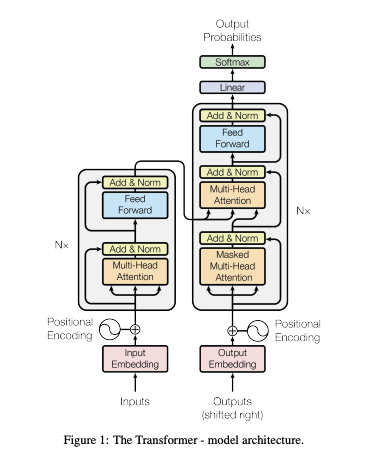
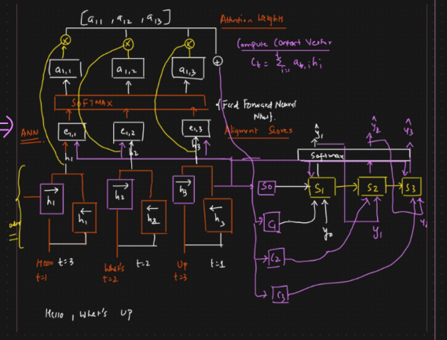

# Transformers

Transformers in natural language processing (NLP) are a type of deep learning model that use *self-attention mechanisms* to analyze and process natural language data. They are encoder-decoder models that can be used for many applications like `translations`.

A Transformer has:

- **An Encoder:** Turns input into hidden states

- **A Decoder:** Turns those into output (only in seq2seq tasks)



In GPT-style models (like ChatGPT), we only use decoder blocks.

Each block consists of:

1. Self-Attention layer

2. Feedforward neural network

3. LayerNorm & residual connections

### Problems with Encoder-Decoder Models

In the encoder-decoder model words are passed as a sequence of words with timestamps through `LSTM` and, context was generated and sent to decoder to generate the values.

The sentence length which was transfered through the `Context` was not enough, because of this problem, `Attention Mechanism` came into the place.

### Problems with Attention Mechanism

In the method along with single context, we create addition context, attention scores, and weights before passing to the `decoder` model.



> 1. Parallely we can not send all the words in a sentence. We can not do the training parallely, it is not scalable if the dataset is Hude.
>
> DATASET --> HUGE --> NOT SCALABLE with respect to training

> 2. Contextual Embedding
>
> In contextual embedding for each word we get a fixed vector.

## 🔄 Multi-Head Attention

Instead of computing attention once, we do it multiple times in parallel (`heads`)

Each `head` learns to focus on different types of relationships (e.g., syntax, meaning)

### Attention via Hugging Face Transformers
```python
from transformers import AutoTokenizer, AutoModel
import torch

tokenizer = AutoTokenizer.from_pretrained("bert-base-uncased")
model = AutoModel.from_pretrained("bert-base-uncased", output_attentions=True)

inputs = tokenizer("The cat sleeps on the mat", return_tensors="pt")
outputs = model(**inputs)

attentions = outputs.attentions  # List of attention weights from each layer
print(attentions[0].shape)  # (batch_size, num_heads, seq_len, seq_len)
```

## Contextual Vectors

In contextual vector we get vectors which are related to the important and related things which are created by self-attention mechanism.


> [Attention Is All You Need - Research Paper](https://proceedings.neurips.cc/paper_files/paper/2017/file/3f5ee243547dee91fbd053c1c4a845aa-Paper.pdf)
